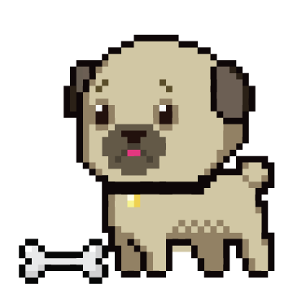
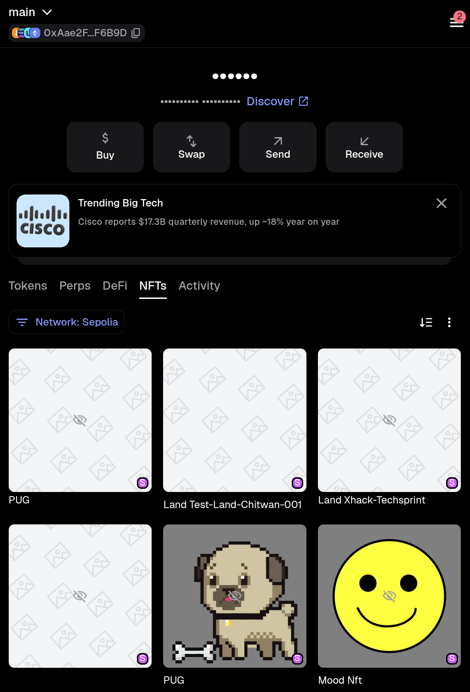
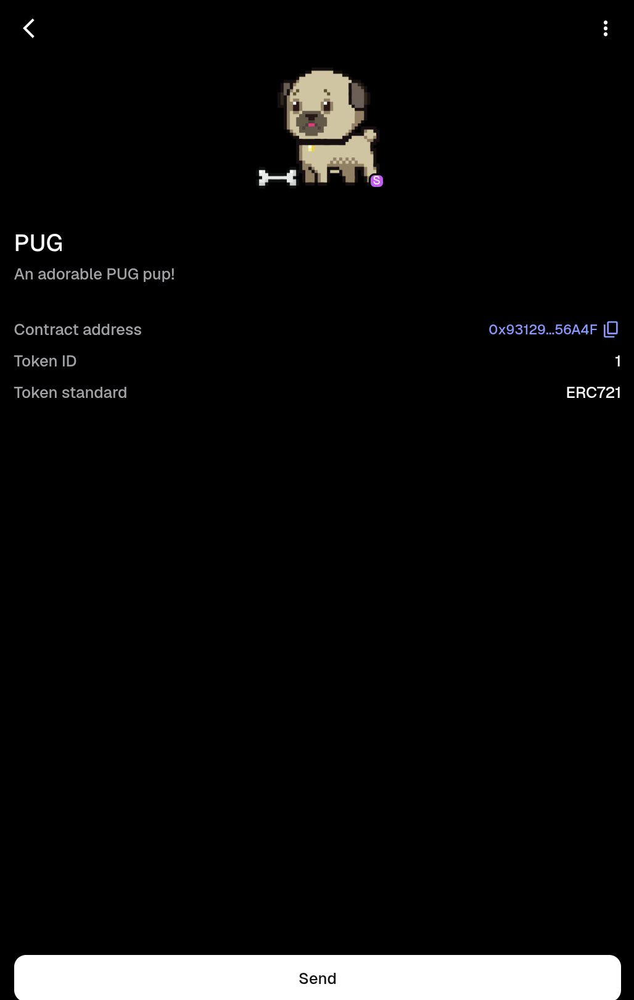
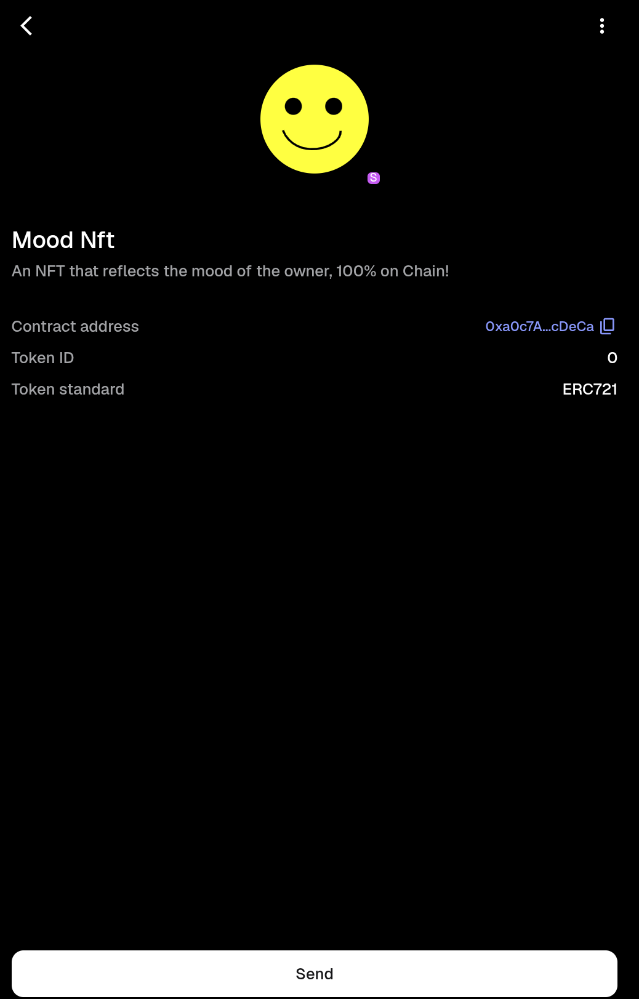

# Foundry NFT

 A Foundry project containing two ERC-721 NFT examples: a simple IPFS-backed NFT and a fully on-chain mood NFT.

 ## Contracts

 ### BasicNft

 `BasicNft` is an ERC-721 contract named `Ginger` with symbol `DOG`. Each minted token receives a token URI supplied by the minter. The deployed Sepolia contract has a PUG token whose metadata and image are available through IPFS.

 ### MoodNft

 `MoodNft` is an ERC-721 contract named `Mood Nft` with symbol `MN`.

 - Each token starts in the `HAPPY` state.
 - The owner or an approved address can call `flipMood(tokenId)`.
 - Metadata is generated on-chain as Base64-encoded JSON.
 - Happy and sad SVG artwork is embedded directly in the contract.

 ## Sepolia deployments

 Network: **Sepolia**
 Chain ID: `11155111`

 | Contract | Address | Verified token |
 | --- | --- | --- |
 | BasicNft | `0x93129a69cb7b7f3c625475514d49532e8f356a4f` | PUG, token ID `1` |
| MoodNft | `0xa0c7A90b52a7f5c55ad176361D49F30be0fcDeCa` | Mood Nft, token ID `0` (happy) |

 The BasicNft deployment transaction is `0xa9ceb82be736ad50edc80d29bb705b7bcf3c75afc31da6b5ba2b5d66dc829ec6`. The MoodNft deployment transaction is `0x3758a38010ed8cdbbbe8392e421f5f0f6116f55feb53742fea91bcb982f070d8`.

 ## Requirements

 - [Foundry](https://book.getfoundry.sh/getting-started/installation)
 - A Sepolia RPC URL
 - A funded Sepolia test wallet

 Store local credentials in `.env`, which is ignored by Git:

 ```dotenv
 SEPOLIA_RPC_URL=https://your-sepolia-rpc-url
 PRIVATE_KEY=your-test-wallet-private-key
 ```

 Never commit `.env`, seed phrases, or private keys. Use a disposable test wallet and Sepolia ETH only.

 ## Install and test

 ```bash
 forge install
 forge build
 forge test -vv
 ```

 ## Local Anvil workflow

 Start Anvil in one terminal:

 ```bash
 make anvil
 ```

 In a second terminal, deploy both contracts locally:

 ```bash
 make deploy
 make deployMood
 ```

 Local contracts use Anvil's chain ID `31337` and receive new addresses each time the local chain is restarted.

 ## Sepolia workflow

 Deploy the contracts to Sepolia:

 ```bash
 make deploy ARGS="--network sepolia"
 make deployMood ARGS="--network sepolia"
 ```

 Mint the BasicNft PUG token:

 ```bash
 make mint ARGS="--network sepolia"
 ```

 Mint MoodNft token `0`:

 ```bash
 make mintMood ARGS="--network sepolia"
 ```

 Flip the MoodNft between happy and sad:

 ```bash
 make flipMood ARGS="--network sepolia"
 ```

 Each command sends a transaction from the wallet identified by the configured private key. MetaMask must be using that same wallet address to display the minted NFT. Wait for the transaction confirmation, then refresh the NFT in MetaMask.

 ## MetaMask

 1. Switch MetaMask to the **Sepolia** network.
 2. Open the **NFTs** tab.
 3. Import the contract address and token ID.

 For the deployed examples:

 ```text
 BasicNft contract: 0x93129a69cb7b7f3c625475514d49532e8f356a4f
 BasicNft token ID: 1

 MoodNft contract: 0xa0c7A90b52a7f5c55ad176361D49F30be0fcDeCa
 MoodNft token ID: 0
 ```

 The MoodNft contract supports changing the image after `flipMood` is confirmed because its token metadata reads the current mood stored on-chain. The deployed token currently shows the happy image. MetaMask's NFT gallery displays the result, but clicking the NFT there does not call the contract. A web interface would be required for a browser button that performs the flip.

 ## NFT artwork

 The artwork files used by the project are included in `img/`:

 ### BasicNft PUG

 

 ### MoodNft happy state

 

 ### MoodNft sad state

 

 ## MetaMask screenshots

 The deployed NFTs are shown in MetaMask on the Sepolia test network:

 ### NFT collection

 

 ### BasicNft PUG

 

 ### MoodNft happy state

 

 The MoodNft screenshot shows token `0` in its initial happy state. A sad-state screenshot can be added after a successful mood flip and MetaMask refresh.

 ## Project layout

 ```text
 src/       Solidity NFT contracts
 script/    Deployment and interaction scripts
 test/      Foundry tests
 lib/       Foundry dependencies
 broadcast/ Saved deployment and transaction records
 ```
